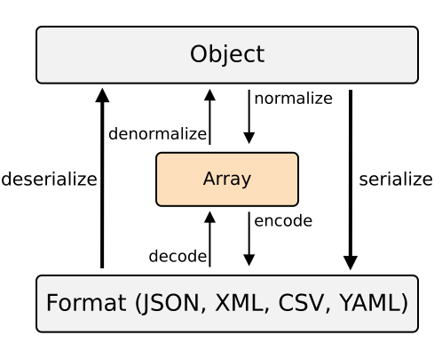

# Serializer

Simple serializer to transform one object type into a data transfer object (DTO) and
that dto into and other object vice versa.



It is inspired by the symfony serializer.

## Installation

```bash
pnpm i @antify/serializer
```

## Usage

Imagine you have a time track entry, which is shown on frontend as a
date input field, a start time input field and an end time input field.

After the client fills out the form, you want to send the data to the server.

```typescript
import {
  defineNormalizer,
  defineEncoder
} from '@antify/serializer';
import {defineSerializer} from "./index";


/**
 * Format after from submit and validation
 */
type TimeTrackValidatedFormType = {
  date: Date;
  startTime: string;
  endTime: string;
};

/**
 * Format to transport data to server
 */
type TimeTrackTDOType = {
  start: string;
  end: string;
};

/**
 * Format expected by server api endpoint request body
 */
type TimeTrackType = {
  start: Date;
  end: Date;
};

const timeTrackSerializer = defineSerializer<
  TimeTrackValidatedFormType, 
  TimeTrackTDOType, 
  TimeTrackType
>(
  /**
   * Normalizer to transform TimeTrackValidatedFormType to TimeTrackTDOType and vice versa
   */
  {
    async denormalize(data: TimeTrackTDOType): Promise<TimeTrackValidatedFormType> {
      return {
        date: new Date(data.start),
        startTime: format(data.start, 'kk:mm'),
        endTime: format(data.end, 'kk:mm'),
      };
    },
    async normalize(data: TimeTrackValidatedFormType): Promise<TimeTrackTDOType> {
      // Append date with start time
      const start = new Date(data.date);
      start.setUTCHours(Number(data.startTime.split(':')[0]));
      start.setUTCMinutes(Number(data.startTime.split(':')[1]));

      // Append date with end time
      const end = new Date(data.date.toISOString());
      end.setUTCHours(Number(data.endTime.split(':')[0]));
      end.setUTCMinutes(Number(data.endTime.split(':')[1]));

      return {
        start: start.toISOString(),
        end: end.toISOString()
      };
    }
  },
  /**
   * Encoder to transform TimeTrackTDOType to TimeTrackType and vice versa
   */
  {
    async decode(data: TimeTrackType): Promise<TimeTrackTDOType> {
      return {
        start: data.start.toISOString(),
        end: data.end.toISOString()
      };
    },
    async encode(data: TimeTrackTDOType): Promise<TimeTrackType> {
      return {
        start: new Date(data.start),
        end: new Date(data.end)
      };
    }
  }
);

/**
 * Usage on client side
 */
const validatedForm: TimeTrackValidatedFormType = {
  date: new Date(),
  startTime: '08:00',
  endTime: '16:00'
};

fetch('https://api.example.com/time-track', {
  method: 'POST',
  headers: {
    'Content-Type': 'application/json'
  },
  body: JSON.stringify(await timeTrackSerializer.normalize(validatedForm))
});

/**
 * Handling request server side (express example)
 */
app.post('/time-track', async (req, res) => {
  // Do validation on req.body first. After success:
  const timeTrack = await timeTrackSerializer.encode(req.body);
});
```
